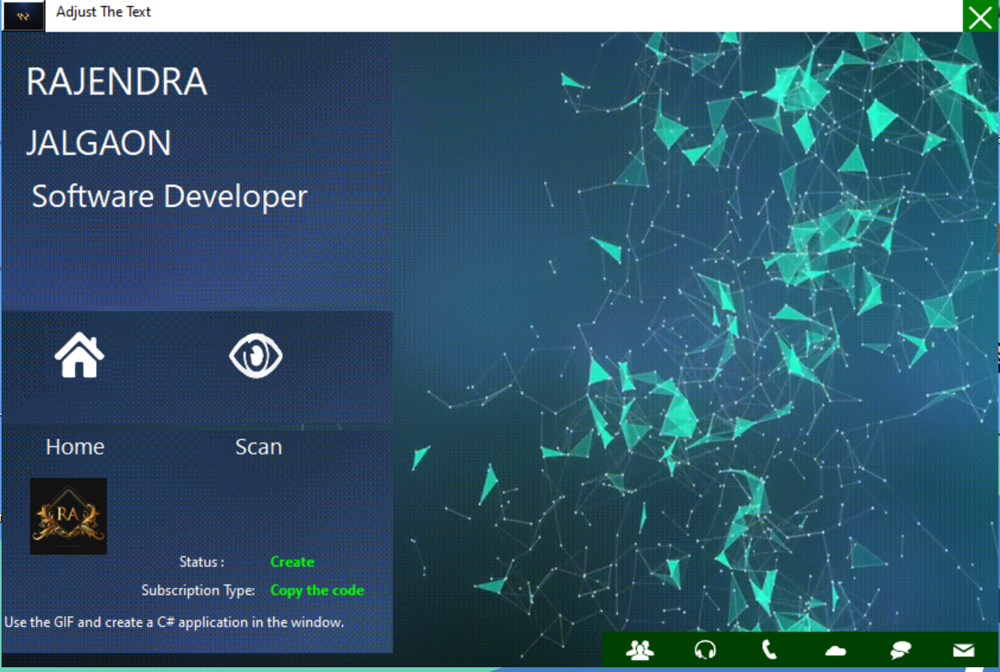
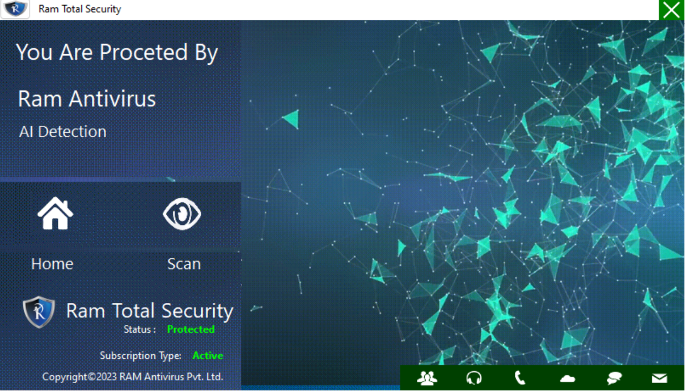
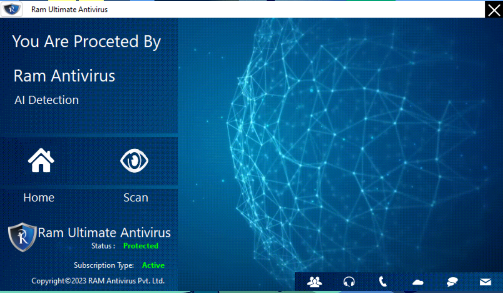

# GIFS_USE
Use the GIF and create a C# application in the window.

GIF stands for Graphics Interchange Format. GIF is a raster file format designed for relatively basic images that appear mainly on the internet. Each file can support up to 8 bits per pixel and can contain 256 indexed colors. GIF files also allow images or frames to be combined, creating basic animations.


## Introduction

GIF is a bitmap image format widely used for its support of animations and ability to store multiple images in a single file.
It supports a maximum of 256 colors, making it suitable for simple graphics and animations.

## Working with GIFs in C# Windows Forms:

- PictureBox Control: In Windows Forms, the PictureBox control is commonly used to display images, including GIFs.
- Bitmap Class: The Bitmap class in the System.Drawing namespace is used to work with images, including loading and displaying GIFs.
- Timer Control: A Timer control is useful for controlling the animation of a GIF by triggering events at regular intervals.
  


## Getting Started

To get started with GIF Application, you need to clone the repository and build the application using Visual Studio or your preferred C# development environment.

### Prerequisites

- Visual Studio or another C# development environment.
- .NET Framework.

### Installation

1. Clone the repository:
   ```shell
   https://github.com/rjghongade/GIFS_USE.git

1. Open the project in Visual Studio.

2. Build and run the application.

# Contact 
```
rajughongade9022@gmail.com
```
[screen_capture.webm](https://github.com/rjghongade/GIFS_USE/assets/105046011/4a5a0832-3e30-4db1-8a04-31b71a60dc51)

### Animating GIF:
1. Use a Timer to control the animation by updating the display at regular intervals.
2. The Timer's Tick event is used to handle animation updates.
3. GifTimer_Tick is called at each interval of the Timer, providing an opportunity for animation updates.



Remember to replace "your_gif_path.gif" with the actual path to your GIF file.

### Social Media

[Linkdin](https://www.linkedin.com/in/rajendra-ghongade-07b337259?utm_source=share&utm_campaign=share_via&utm_content=profile&utm_medium=android_app)

[RAM Antivirus](https://www.linkedin.com/company/ram-ultimate-antivirus/)

### Work On Ram Antivirus Jalgaon, Maharastra.
[Ram_Antivirus](https://ramantivirus.com/)


   

