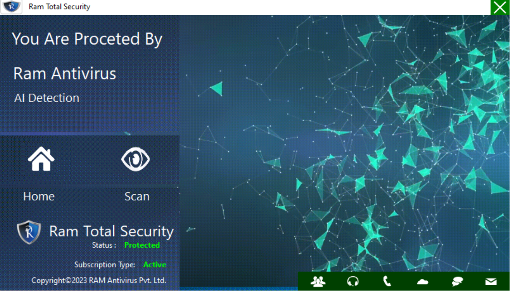

# GIFS_USE
Use the GIF and create a C# application in the window.

# Folder-Locker
Folder Locker is a simple folder-locking application built using C# and WPF.


## Introduction

Folder Locker is designed to provide a basic folder-locking functionality. Users can lock and unlock folders using a password.
## Features

- Lock and unlock folders.
- Secure password-based folder unlocking.
- Simple and easy-to-use user interface.
  


## Getting Started

To get started with Folder Locker, you need to clone the repository and build the application using Visual Studio or your preferred C# development environment.

### Prerequisites

- Visual Studio or another C# development environment.
- .NET Framework.

### Installation

1. Clone the repository:
   ```shell
   git clone https://github.com/rjghongade/Folder-Locker.git

1. Open the project in Visual Studio.

2. Build and run the application.

# Contact 
```
rajughongade9022@gmail.com
```

### Usage
1. Launch the application.
2. Log in with your credentials.
3. Select a folder to lock.
4. Lock the folder by clicking the "Lock Folder" button.
5. To unlock a folder, use the "Unlock Folder" button and enter the correct password.

### Contributing
Contributions are welcome. Please submit bug reports or feature requests through the GitHub issue tracker.

A "Folder Locker" is a software application designed to secure and protect specific folders on a computer or storage device. It offers users a way to restrict access to sensitive or private data stored in these folders, ensuring that only authorized individuals can view, modify, or delete the contents.

Key features of a typical folder locker application include:

1. Folder Locking: Users can select folders they want to secure, and the application employs encryption or access control mechanisms to prevent unauthorized access.

2. Password Protection: Folders are typically protected with a password, PIN, or passphrase. Access is granted only to those who know the correct combination.

3. Security Levels: Some folder lockers offer different levels of security, including basic password protection, advanced encryption, and hiding folders from view.

4. Ease of Use: Many folder locker applications have user-friendly interfaces that make it easy to lock and unlock folders.

5. File Recovery: In case users forget their passwords or need to recover locked data, some folder lockers provide recovery options.

6. Privacy: Folder lockers are often used to protect personal, financial, or confidential data, helping users maintain their privacy and safeguard sensitive information.

7. Customization: Users can typically customize the level of security and access settings for each locked folder.

Folder locker applications are commonly used for personal and professional reasons. They can secure personal files, confidential work-related documents, and more. However, it's important to choose a reputable and trustworthy folder locker to ensure the security of your data. Always keep backups of important information and remember your passwords to prevent accidental data loss.

[Folder_Locker](https://github.com/rjghongade/Folder-Locker.git)

### Social Media

[Linkdin](https://www.linkedin.com/in/rajendra-ghongade-07b337259?utm_source=share&utm_campaign=share_via&utm_content=profile&utm_medium=android_app)

[RAM Antivirus](https://www.linkedin.com/company/ram-ultimate-antivirus/)

### Work On Ram Antivirus Jalgaon, Maharastra.
[Ram_Antivirus](https://ramantivirus.com/)


   

